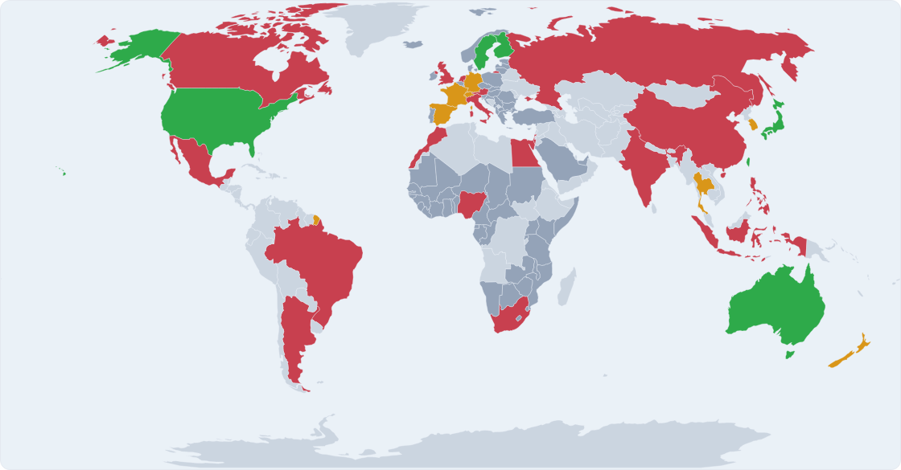

<p align="center">
  <a href="https://patentclient.com/atlas">
    
  </a>
</p>

**Give your AI agent access to the world's patent and trademark data.**

[](https://github.com/parkerhancock/patent-client-agents/actions/workflows/ci.yml)
[](https://patentclient.com/)
[](https://docs.patentclient.com/)
[](https://www.python.org/downloads/)
[](LICENSE)

**Project home: [patentclient.com](https://patentclient.com/)** · **Full documentation: [docs.patentclient.com](https://docs.patentclient.com/)**

## Use the hosted demo

The fastest path — nothing to install. Point any MCP-speaking client
(Claude Code, OpenAI Codex CLI, Google Antigravity CLI, Google Gemini CLI, Cursor, Windsurf,
Cline, Zed, Continue.dev, VS Code Copilot Chat, JetBrains AI, Claude
Desktop, ChatGPT Apps, Replit Agent, CoWork, …) at the public demo at
**[mcp.patentclient.com](https://mcp.patentclient.com)**:

```json
{
  "mcpServers": {
    "patent-client-agents": {
      "url": "https://mcp.patentclient.com/mcp"
    }
  }
}
```

Most clients also expose a "custom connector" / "add MCP server" UI
that takes just the URL `https://mcp.patentclient.com/mcp` — no tokens
to paste. On first connect you'll be sent to Google sign-in; approve
and you're in. Any verified Google account works.

The demo has per-account limits and a curated tool surface. Do not send
confidential material through it. See the
[hosted-demo operations guide](https://docs.patentclient.com/hosted-demo/)
for limits, omissions, WAF behavior, and confidentiality guidance.

## Or install locally

`patent-client-agents` is an MCP server, so it works with **any
MCP-speaking client**. Claude Code, OpenAI Codex CLI, and Google
Antigravity CLI are first-class deployment targets with native plugin
packages. Cursor, Windsurf, Cline, Zed, Continue.dev, VS Code Copilot
Chat, JetBrains AI Assistant, Claude Desktop, ChatGPT (remote URL), and
Replit Agent (remote URL) can connect directly through MCP.

### Path A — Native agent plugin

Each plugin launches the same pinned PyPI release through `uvx` and exposes
136 tools by default, or up to 234 when private credentials are configured.
The three host packages are generated from `satchel.yaml`; that manifest is
the source of truth for their shared identity, version, and MCP component.

**Claude Code**

```
/plugin marketplace add parkerhancock/patent-client-agents
/plugin install patent-client-agents@patent-client-agents
/reload-plugins
```

**OpenAI Codex CLI**

```bash
codex plugin marketplace add parkerhancock/patent-client-agents
codex plugin add patent-client-agents@patent-client-agents
```

**Google Antigravity CLI**

```bash
git clone --depth 1 https://github.com/parkerhancock/patent-client-agents.git
agy plugin install ./patent-client-agents/plugins/patent-client-agents
```

Start a new agent session after installing. See the
[installation guide](https://docs.patentclient.com/install/agent-plugins/)
for updates, removal, verification, and credential setup.

### Path B — Direct MCP connection

```bash
pip install 'patent-client-agents[mcp]'
```

This puts `patent-client-agents-mcp` on PATH. Point your client's MCP
config at it:

<details>
<summary><strong>OpenAI Codex CLI</strong> — <code>~/.codex/config.toml</code></summary>

```toml
[mcp_servers.patent-client-agents]
command = "patent-client-agents-mcp"
env = { USPTO_ODP_API_KEY = "…" }
```

Or use the CLI: `codex mcp add patent-client-agents --env USPTO_ODP_API_KEY=… -- patent-client-agents-mcp`.
</details>

<details>
<summary><strong>Google Antigravity CLI</strong> — <code>~/.gemini/antigravity-cli/mcp_config.json</code></summary>

```json
{
  "mcpServers": {
    "patent-client-agents": {
      "command": "patent-client-agents-mcp",
      "env": { "USPTO_ODP_API_KEY": "$USPTO_ODP_API_KEY" }
    }
  }
}
```

Workspace-local configuration can instead live at `.agents/mcp_config.json`.
Launch `agy` and use `/mcp` to verify the server.
</details>

<details>
<summary><strong>Google Gemini CLI</strong> — <code>~/.gemini/settings.json</code></summary>

```json
{
  "mcpServers": {
    "patent-client-agents": {
      "command": "patent-client-agents-mcp",
      "env": { "USPTO_ODP_API_KEY": "$USPTO_ODP_API_KEY" }
    }
  }
}
```

Gemini interpolates `$VAR` / `${VAR}` from the parent shell (note: `.env`
files in the project root are *not* loaded — variables must be in the
actual environment).
</details>

<details>
<summary><strong>Cursor / Windsurf / Cline / Claude Desktop / JetBrains AI</strong> — same JSON shape</summary>

All five use the same `mcpServers` schema; only the config file path differs:

| Client | Config file |
|---|---|
| Cursor | `~/.cursor/mcp.json` (or project-level `.cursor/mcp.json`) |
| Windsurf | `~/.codeium/windsurf/mcp_config.json` (uses `serverUrl` instead of `url` for remote) |
| Cline | extension UI → "Configure MCP Servers" |
| Claude Desktop | `~/Library/Application Support/Claude/claude_desktop_config.json` (macOS), `%APPDATA%\Claude\claude_desktop_config.json` (Windows) |
| JetBrains AI Assistant | Settings → Tools → AI Assistant → MCP → Add |

```json
{
  "mcpServers": {
    "patent-client-agents": {
      "command": "patent-client-agents-mcp",
      "env": { "USPTO_ODP_API_KEY": "…" }
    }
  }
}
```
</details>

<details>
<summary><strong>VS Code Copilot Chat (Agent mode)</strong> — <code>.vscode/mcp.json</code></summary>

VS Code uses `servers` (not `mcpServers`) and requires a `type` field:

```json
{
  "servers": {
    "patent-client-agents": {
      "type": "stdio",
      "command": "patent-client-agents-mcp",
      "env": { "USPTO_ODP_API_KEY": "${input:uspto-odp-key}" }
    }
  },
  "inputs": [
    { "id": "uspto-odp-key", "type": "promptString", "description": "USPTO ODP API key", "password": true }
  ]
}
```

Tools only appear in Copilot's **Agent mode**, not in Ask or Edit.
</details>

<details>
<summary><strong>Zed</strong> — <code>~/.config/zed/settings.json</code></summary>

Zed calls them "context servers":

```json
{
  "context_servers": {
    "patent-client-agents": {
      "source": "custom",
      "command": "patent-client-agents-mcp",
      "env": { "USPTO_ODP_API_KEY": "…" }
    }
  }
}
```
</details>

<details>
<summary><strong>Continue.dev</strong> — <code>~/.continue/config.yaml</code></summary>

YAML, with `${{ secrets.NAME }}` for secret references:

```yaml
mcpServers:
  - name: patent-client-agents
    command: patent-client-agents-mcp
    env:
      USPTO_ODP_API_KEY: ${{ secrets.USPTO_ODP_API_KEY }}
```
</details>

<details>
<summary><strong>ChatGPT Apps / Replit Agent</strong> (remote URL only)</summary>

These clients are cloud-hosted and can't spawn local subprocesses. Either
point them at the hosted demo via their UI:

```
https://mcp.patentclient.com/mcp
```

…or self-host `patent-client-agents-mcp` behind an HTTPS endpoint. For
ChatGPT: Settings → Connectors → enable Developer mode → Create. For
Replit: Integrations → MCP Servers for Replit Agent → Add MCP server.
</details>

### Path C — Python library

```bash
pip install patent-client-agents
```

Direct async use from your own Python — no MCP runtime needed.

See [docs.patentclient.com/installation](https://docs.patentclient.com/installation/)
for the full per-client reference, remote-MCP setup, and corpus-build steps.

---

## What You Can Do

Ask your agent to research patents and trademarks in natural language:

> "Find [Company]'s recent battery patents and summarize the key innovations"

> "What's the prosecution history for US Patent 11,234,567?"

> "Compare [Company A] and [Company B]'s patent portfolios in mobile display technology"

> "Track the legal status of EP3456789 across all designated states"

> "What's the current status of trademark serial 97123456, and who filed it?"

> "Search the TMEP for guidance on Section 2(d) likelihood-of-confusion refusals"

`patent-client-agents` covers the major patent and trademark offices worldwide — see the full map at **[patentclient.com/atlas](https://patentclient.com/atlas)**.

- **Americas** — USPTO (patents, trademarks, assignments, office actions), US Copyright Office, Federal Circuit (CAFC), US International Trade Commission (Section 337), CanLII Canada
- **Europe** — EPO OPS, EUIPO (EU trademarks + designs), Unified Patent Court (decisions + statutes), DPMA Germany (registers + statutes), INPI France (TM + designs), Légifrance (French IP code + trade secrets)
- **Asia** — China SPC IP Court hearing notices, Japan IP High Court patent and utility-model case lists, JPO Japan, KIPO Korea, TIPO Taiwan, IPO India (Acts + MPPP), Taiwan Trade Secrets Act
- **Oceania** — IP Australia (patents, trade marks, designs, bulk catalog)
- **Multilateral** — Google Patents (global search), WIPO Lex (~50k IP statutes across ~200 jurisdictions)
- **Examiner & classification corpora** — MPEP, TMEP, EPC + four EPO Guidelines families, Case Law of the Boards of Appeal, CPC (with IPC mapping)

JPO, CanLII, EUIPO, IP Australia, KIPO, TIPO, and INPI MCP tools register on the local stdio server and native agent plugins only when their credentials are set in the environment; the hosted demo at `mcp.patentclient.com` does not carry those credentials, so those tool families don't appear there.

## Coverage

The canonical, human-readable inventory is the
[`catalog/`](https://github.com/parkerhancock/patent-client-agents/tree/main/catalog).
It includes shipped data products and known sources that are restricted,
blocked, commercial, or not yet connected.

| Source | What You Get |
|--------|--------------|
| **Google Patents** | Global search, full-text, citations, PDFs, families |
| **USPTO ODP** | Applications, prosecution history, PTAB trials & appeals, petitions, bulk data |
| **USPTO Publications** | Patent Public Search (PPUBS) full-text search and document retrieval |
| **USPTO Assignments** | Patent ownership transfers and reel/frame lookups |
| **USPTO Office Actions** | Rejection analytics, cited references, full-text OA retrieval |
| **USPTO TSDR** | Trademark Status & Document Retrieval — status, docs, mark images |
| **USPTO Trademark Search (TESS)** | Live trademark register — search by wordmark, owner, goods/services — *requires the `[tmsearch]` extra (Playwright + curl_cffi) or a bring-your-own WAF token via `PCA_WAF_TOKEN_*`* |
| **USPTO Trademark Assignments** | Trademark ownership transfers (Assignment Center) |
| **EPO OPS** | European and worldwide patents, INPADOC families, legal events, and EP Register data. `search_epo` includes optional CN, DE, and KR publication recipes. |
| **IP Australia** | Australian patents, trade marks, and registered designs from IP Australia's OAuth 2.0 search APIs, plus the weekly IP RAPID bulk catalog on data.gov.au (CC-BY 4.0) — *live-search MCP tools register when `IPAUSTRALIA_CLIENT_ID` + `IPAUSTRALIA_CLIENT_SECRET` are set; bulk catalog is public, no auth* |
| **IPOS Singapore** | The four Singapore IP statutes (Patents Act 1994, Trade Marks Act 1998, Registered Designs Act 2000, Copyright Act 2021) plus the three IPOS examination / work manuals (Patent Examination Guidelines, Trade Marks Work Manual, Industrial Designs Work Manual) — *public, no auth; runs against local SQLite/FTS5 snapshots built by `patent-client-agents-build-ipos-statutes-corpus` and `patent-client-agents-build-ipos-manuals-corpus`* |
| **INPI Brazil** | Brazilian IP — weekly Revista da Propriedade Industrial (RPI) bulk feed (patents, trade marks, designs, GIs, IC topographies, software programs, technology contracts, INPI communications) on `dados.gov.br` (no auth; Decreto 8.777/2016), plus a corpus-backed view of the LPI (Lei 9.279/1996) — Brazil's unified IP statute (patents + designs + trade marks + GIs + trade-secrets / unfair-competition in one law). The LPI corpus bundles authoritative Portuguese (Planalto) and English (WIPO Lex) text per Article and runs against a local SQLite/FTS5 snapshot built by `patent-client-agents-build-inpi-br-statutes-corpus`. |
| **ILPO Israel** | Five Israeli IP statutes (Patents Law 1967, Trade Marks Ordinance 1972, Designs Law 2017, Copyright Act 2007, and the distinctive **Commercial Torts Law 1999** — Israel's standalone trade-secret statute with statutory damages in Art. 13), plus the data.gov.il CKAN trade-mark register feed — *statutes run against a local SQLite/FTS5 snapshot built by `patent-client-agents-build-ilpo-statutes-corpus`; TM feed is public, no auth* |
| **JPO** | Japanese patents, examination history, PCT national phase — *MCP tools register when `JPO_API_USERNAME` + `JPO_API_PASSWORD` are set; not exposed by the hosted demo* |
| **Japan IP High Court** | Official weekly workbook of pending and recently closed suits seeking cancellation of JPO patent or utility-model decisions. Search by court case number, patent/application number, proceeding type, division, disposition, or date. The workbook does not publish parties and is not a general infringement docket — *public, no auth* |
| **TIPO Taiwan** | Taiwan patents, utility models, designs, and trademarks via the TIPO OpenData REST API — biblio-only (no claims/figures/abstracts in API); covers `TW/TIPO/Patents`, `TW/TIPO/UtilityModels`, `TW/TIPO/Designs`, and `TW/TIPO/Trademarks` with combined `*_events` surfaces for post-filing alterations / changes / divisions. *MCP tools register when `TIPO_API_KEY` (a single `tk` UUID issued by TIPO on request) is set; not exposed by the hosted demo* |
| **KIPO Korea** | Korean patents and utility models, trademarks, and designs via the KIPRIS Plus REST API operated by KIPI on behalf of KIPO. Free-text + structured search on each register, single-number fetch with list-accept (capped at 50). *9 MCP tools register when `KIPO_KIPRIS_API_KEY` and an operator-verified HTTPS `KIPO_KIPRIS_BASE_URL` are set. The documented HTTP endpoint is disabled because it would expose the query-string API key. BYOK per KIPRIS Plus ToS §11 — per-user keys only, no shared-key proxy permitted; not exposed by the hosted demo.* |
| **China SPC IP Court** | Public scheduled-hearing notices from China's national appellate court for patent and other technology-related IP matters, plus official-site search. Extracts hearing date, party roles, venue, and dispute type where published. This is a hearing calendar rather than a complete docket, and notices often omit case and patent numbers — *public, no auth* |
| **INPI France** | French national trademarks (WIPO ST.66 v1.0) and designs (WIPO ST.86 v1.0) from `api-gateway.inpi.fr` — search + fetch with Nice / Locarno class, applicant, status, and date-range filters. TM + Design only; FR patents covered through EPO OPS (INPADOC). *MCP tools register when `INPI_USERNAME` + `INPI_PASSWORD` are set; BYOK — production deployers must register a personal `data.inpi.fr` account.* |
| **IP-office fee schedules** | Live patent, trademark, and design fee schedules for 25 offices and international systems. TÜRKPATENT coverage includes official patent and utility-model, trademark, and industrial-design tables in TRY, with the Resmî Gazete authority recorded in each schedule. |
| **IPO India** | The four core Indian IP Acts (Patents Act 1970 with §3(d), §25, §84; Designs Act 2000; Trade Marks Act 1999; Copyright Act 1957) + Patent Rules 2003 (incl. 2024 amendments), plus the IPO India Manual of Patent Practice & Procedure (MPPP v3.0, 2019). Citation forms: `Section 3(d) Patents Act`, `Rule 71 Patent Rules`, `MPPP Chapter 04.05.01`. *Runs against local SQLite/FTS5 snapshots built by `patent-client-agents-build-ipo-in-statutes-corpus` and `patent-client-agents-build-ipo-in-mppp-corpus`* |
| **DPMA Germany** | German patents and utility models, national trademarks, and national designs through DPMAconnectPlus, plus six bundled German IP statutes. *The 6 register tools need `DPMA_CONNECTPLUS_USERNAME` + `DPMA_CONNECTPLUS_PASSWORD` and requests from the account's registered static IP. The register connector is mock-only tested; live compatibility is unverified. Community testing or sanitized XML samples are welcome. Private BYOK only; not exposed by the hosted demo.* |
| **Swiss IPI** | Swiss patents, patent publication notices, national trademarks, SPCs, and SPC publication notices through the Swissreg datadelivery API. *The 8 tools need `IPI_DATA_USERNAME` + `IPI_DATA_PASSWORD`; `IPI_DATA_TOTP_TOKEN` is optional for MFA accounts. The connector is schema-tested only and marked beta. Live account testing and sanitized XML samples are welcome. Private BYOK only; not exposed by the hosted demo.* |
| **OEPM Spain** | Exact-file patent, trademark, trade-name, and industrial-design records through the CEO SOAP service. *The 3 tools need `OEPM_CEO_USERNAME` + `OEPM_CEO_PASSWORD`. Public-WSDL tested beta; live account compatibility is unverified. Private BYOK only.* |
| **IPONZ New Zealand** | Patent, trade mark, and design details plus date-range update lists through the MBIE IPONZ v5 API. *The 7 tools need `IPONZ_SUBSCRIPTION_KEY`; an optional current bearer token can use `IPONZ_ACCESS_TOKEN`. Public OpenAPI and XSD-contract tested beta; live subscription compatibility is unverified. Private BYOK only.* |
| **Thailand DIP** | Patents, petty patents, design patents, trademarks, copyright notifications, music copyright, and geographical indications through DIP Data Exchange. *The 9 tools need `DIP_DATA_EXCHANGE_TOKEN`. Official-catalogue tested beta; live account compatibility is unverified. Private BYOK only.* |
| **Légifrance IP** | The French intellectual-property statutes — Code de la propriété intellectuelle (CPI: patents L.611, trade marks L.711, designs L.511, copyright L.111) plus the Code de commerce L.151 trade-secret regime — bundled into one searchable corpus. Citation forms: `L. 611-10 CPI`, `Art. L. 611-10 CPI`, `L611-10 CPI`, `L. 151-1 Code de commerce`. *Runs against a local SQLite/FTS5 snapshot built by `patent-client-agents-build-legifrance-ip-corpus`* |
| **Taiwan Trade Secrets** | The Taiwan Trade Secrets Act (營業秘密法) in the official English translation published by law.moj.gov.tw/Eng — Articles 1, 2, 3, 10, 11, 13, and 13-1 (legislative purpose, trade-secret definition, employee-derived ownership, acts of misappropriation, injunction + damages, treble damages, criminal liability). Citation forms: `Art. 2 Trade Secrets Act`, `Section 13 Trade Secrets Act`, `Art. 13-1`, bare numeric `13` / `13-1`. *Runs against a local SQLite/FTS5 snapshot built by `patent-client-agents-build-tw-trade-secrets-corpus`* |
| **MPEP** | Manual of Patent Examining Procedure search and section lookup — *runs against a local SQLite/FTS5 snapshot built by `patent-client-agents-build-mpep-corpus`; see docs/installation.md* |
| **TMEP** | Trademark Manual of Examining Procedure search and section lookup — *runs against a local SQLite/FTS5 snapshot built by `patent-client-agents-build-tmep-corpus`; see docs/installation.md* |
| **CPC** | Classification hierarchy lookup, search, and CPC/IPC mapping |
| **Canada Federal Court case files** | Official party/corporation search, exact case metadata, public parties/counsel, patent references, and recorded docket entries. Status is conservatively inferred as `likely_pending`, `likely_closed`, or `unknown` because the Court does not publish an authoritative status field — *public, no auth* |
| **CanLII** | Canadian courts, tribunals, and IP statutes — Federal Court (`fct`), Federal Court of Appeal (`fca`), Supreme Court of Canada (`csc-scc`) IP rulings (post-filtered by IP-rights keywords), Trade-marks Opposition Board (`tmob-comc`), Patent Appeal Board (`cab-cab`), plus all four Canadian IP Acts (Patent Act, Trademarks Act, Industrial Design Act, Copyright Act) with point-in-time queries. `search_canlii_ip_cases` rolls all five court/tribunal databases up in one call; `list_canlii_ip_statutes` returns the statute catalog — *MCP tools register when `CANLII_API_KEY` is set; not exposed by the hosted demo* |
| **WIPO Lex** | Global IP statute / treaty / judgment database curated by WIPO — ~50k legal documents across ~200 jurisdictions, six UN languages. v0.9 scope: legislation collection (search + detail with PDF links) |
| **EUIPO** | EU Trade Marks (~2.3M EUTMs since 1996) + Registered Community Designs (~1.5M RCDs since 2003). RSQL search, full prosecution records, multilingual goods-and-services / product indications, sandbox toggle — *MCP tools register when `EUIPO_CLIENT_ID` + `EUIPO_CLIENT_SECRET` are set; not exposed by the hosted demo* |
| **Federal Circuit (CAFC)** | Every patent appeal in the US is appealable to the Federal Circuit. Search opinions by date / origin (PTO, DCT, ITC, CFC), classify as patent vs. non-patent, download opinion PDFs |
| **USITC** | EDIS (Section 337 patent enforcement investigations + dockets + attachments), DataWeb (US trade statistics), HTS (Harmonized Tariff Schedule), IDS (IP investigation index) — *EDIS and DataWeb need free user-minted tokens; HTS and IDS are public* |
| **US Copyright Office** | Copyright registrations (post‑1978 + digitized card catalog) and recorded documents (transfers, assignments, licenses) via the Public Records System — *public, no auth* |
| **UPC (Unified Patent Court)** | Decisions-and-orders feed (CFI + CoA + Central / Local / Regional Divisions, with canonical case IDs and PDF/A URLs) plus a corpus-backed view of the UPC Agreement, consolidated Rules of Procedure, and Table of Court Fees in EN/FR/DE — *public, no auth; statutes run against a local SQLite/FTS5 snapshot built by `patent-client-agents-build-upc-statutes-corpus`* |
| **EPO Statutes & Case Law** | The five canonical EPO legal corpora: **EPC** (180 Articles + 176 Implementing Regulations), **Guidelines for Examination** (~1,800 sections), **PCT-EPO Guidelines** (~750 sections — applies when the EPO acts as ISA/IPEA), **Unitary Patent Guidelines** (~140 sections — UP opt-in, fees, renewals), and **Case Law of the Boards of Appeal** "white book" (~2,600 sections). Each corpus accepts native citation forms (`Art. 54`, `R. 71`, `G-II, 3.1`, `I.A.1`, dotted `1.2.1`). All five run against local SQLite/FTS5 snapshots built by `patent-client-agents-build-{epc,guidelines,pct-guidelines,up-guidelines,caselaw}-corpus`. |

All sources include automatic caching (hishel + SQLite with WAL), rate limiting,
and retry logic via `mcp-data-core`.

## API keys

136 patent + IP MCP tools are exposed by default. Credentialed
families register when their environment variables are present, bringing
the local/private surface up to 234 tools when every env-gated family is
configured.

| Variable | Source | Required | How to get |
|----------|--------|----------|------------|
| `USPTO_ODP_API_KEY` | USPTO ODP | Most USPTO patent tools | [developer.uspto.gov](https://developer.uspto.gov/) (free) |
| `USPTO_TSDR_API_KEY` | USPTO TSDR | All TSDR trademark tools | [account.uspto.gov/api-manager/](https://account.uspto.gov/api-manager/) (free MyUSPTO account) |
| `EPO_OPS_API_KEY`, `EPO_OPS_API_SECRET` | EPO OPS | All EPO tools | [developers.epo.org](https://developers.epo.org/) (free) |
| `JPO_API_USERNAME`, `JPO_API_PASSWORD` | JPO | All JPO library + MCP tools (env-gated on the stdio server / plugin; not set on the hosted demo) | [j-platpat.inpit.go.jp](https://www.j-platpat.inpit.go.jp/) |
| `KIPO_KIPRIS_API_KEY`, `KIPO_KIPRIS_BASE_URL` | KIPO KIPRIS Plus | All KIPO library + MCP tools. `KIPO_KIPRIS_BASE_URL` must be an operator-verified HTTPS endpoint; the documented HTTP endpoint is rejected to protect the query-string API key. | [plus.kipris.or.kr](https://plus.kipris.or.kr/eng/main.do) (per-user BYOK key) |
| `DPMA_CONNECTPLUS_USERNAME`, `DPMA_CONNECTPLUS_PASSWORD` | DPMAconnectPlus | Six German register tools (env-gated; private BYOK only; mock-only tested) | [DPMAconnectPlus application information](https://www.dpma.de/english/search/data_supply_services/dpmaconnect/index.html). DPMA also requires a registered static IP. |
| `IPI_DATA_USERNAME`, `IPI_DATA_PASSWORD` | Swiss IPI datadelivery | Eight Swiss patent, trademark, SPC, and publication tools (env-gated; private BYOK only; schema-tested) | [IPI data delivery API application information](https://www.ige.ch/en/services/digital-resources/ip-data/data-delivery-api). Signed Terms of Use are required. Set `IPI_DATA_TOTP_TOKEN` when the account requires MFA. |
| `OEPM_CEO_USERNAME`, `OEPM_CEO_PASSWORD` | OEPM Spain CEO | Three exact-file register tools (env-gated; private BYOK only; WSDL-tested) | [OEPM web services](https://www.oepm.es/es/sobre-OEPM/servicios-al-ciudadano/servicios-gratuitos/Servicios-web-de-la-OEPM/). |
| `IPONZ_SUBSCRIPTION_KEY` | IPONZ New Zealand | Seven patent, trade mark, and design tools (env-gated; private BYOK only; contract-tested) | [MBIE IPONZ API portal](https://portal.api.business.govt.nz/api/iponz). Set optional `IPONZ_ACCESS_TOKEN` when the subscription also requires a current bearer token. |
| `DIP_DATA_EXCHANGE_TOKEN` | Thailand DIP | Nine register search and exact-identifier tools (env-gated; private BYOK only; catalogue-tested) | [DIP Data Exchange catalogue](https://api.ipthailand.go.th/data-exchange/view/home.aspx). Paper-contract registration is required. |
| `CANLII_API_KEY` | CanLII | All CanLII library + MCP tools (env-gated on the stdio server / plugin; not set on the hosted demo) | [canlii.org/en/feedback/feedback.html](https://www.canlii.org/en/feedback/feedback.html) (free, by request) |
| `EUIPO_CLIENT_ID`, `EUIPO_CLIENT_SECRET` | EUIPO | All EUIPO library + MCP tools (env-gated; not set on the hosted demo). Set `EUIPO_ENV=sandbox` to use the open sandbox environment instead of production. | [dev.euipo.europa.eu](https://dev.euipo.europa.eu/) (sandbox auto-approves; production requires ID-document review) |
| `USITC_EDIS_TOKEN` | USITC EDIS | EDIS document/attachment downloads (also rejected for *public* docs without a token); investigation+document search itself works without one | [edis.usitc.gov](https://edis.usitc.gov) → API Token Generator (free, Login.gov account). JWT, ~2 wk lifetime |
| `USITC_DATAWEB_TOKEN` | USITC DataWeb | `run_dataweb_report` only | [dataweb.usitc.gov](https://dataweb.usitc.gov) account page (free) |
| `PCA_WAF_TOKEN_PATH` *or* `PCA_WAF_TOKEN_JSON` | USPTO TESS | Trademark search via TESS — bring-your-own WAF token *or* install `[tmsearch]` extra to mint via Playwright | See [USPTO Trademark Search docs](https://docs.patentclient.com/api/uspto-tmsearch/) |

**No API key needed:** Google Patents, USPTO Publications (PPUBS), USPTO
Assignments, USPTO Trademark Assignments, MPEP, TMEP, CPC, WIPO Lex,
Federal Circuit (CAFC), Canada Federal Court case files, China SPC IP Court
hearing notices, Japan IP High Court patent and utility-model case lists, USITC HTS, USITC IDS,
US Copyright Office.

### `tmsearch` extra (Playwright + curl_cffi)

USPTO TESS sits behind AWS WAF. To mint the WAF token in-process, install
the optional extra and bootstrap Chromium once:

```bash
pip install 'patent-client-agents[tmsearch]'
playwright install chromium
```

On headless server deployments where Playwright isn't installed, set
`PCA_WAF_TOKEN_JSON` to a token JSON payload (Secret Manager mount) or
`PCA_WAF_TOKEN_PATH` to a path on disk — the client will reuse the
cached token until it expires (~4 days).

## Quickstart — Python library

```bash
pip install patent-client-agents
```

```python
from patent_client_agents.google_patents import GooglePatentsClient

async with GooglePatentsClient() as client:
    patent = await client.get_patent_data("US10123456B2")
    print(patent.title)
    print(patent.abstract)

    results = await client.search_patents(keywords=["machine learning neural network"])
    for r in results.results:
        print(f"{r.publication_number}: {r.title}")
```

## Detailed Coverage

<details>
<summary><strong>Google Patents</strong></summary>

| Feature | Description |
|---------|-------------|
| Patent lookup | Fetch by publication number |
| Full-text search | Keyword, assignee, inventor search |
| Claims & description | Full-text content |
| Citations | Forward and backward citations |
| Patent families | Related applications |
| PDF download | Full document PDFs |

</details>

<details>
<summary><strong>USPTO Open Data Portal</strong></summary>

| Feature | Description |
|---------|-------------|
| **Applications** | |
| Application search | Search by number, date, status |
| Application details | Bibliographic data, status |
| Continuity data | Parent/child relationships |
| Foreign priority | Priority claims |
| Assignments | Ownership records |
| Attorneys | Attorney/agent of record |
| Transactions | Office action history |
| Adjustments | PTA/PTE data |
| **PTAB Trials** | |
| IPR/PGR/CBM search | Search inter partes reviews |
| Trial details | Party info, status, decisions |
| Trial documents | Petitions, responses, decisions |
| **PTAB Appeals** | |
| Appeal search | Ex parte appeals |
| Appeal details | Status, decisions |
| **Bulk Data** | |
| Bulk downloads | XML/JSON data packages |
| Full-text grants | Weekly patent grants |
| Full-text applications | Weekly applications |

</details>

<details>
<summary><strong>USPTO Assignments</strong></summary>

| Feature | Description |
|---------|-------------|
| Assignment search | Search by reel/frame, patent |
| Assignment details | Parties, conveyance type |
| Property lookup | Patents in assignment |

</details>

<details>
<summary><strong>USPTO TSDR (Trademark Status & Document Retrieval)</strong></summary>

| Feature | Description |
|---------|-------------|
| Status lookup | Mark text, filing/registration dates, current status |
| Prosecution documents | Office actions, responses, registration certificate |
| Mark images | Drawing JPGs by serial number |
| Batch status | Check many serial numbers in one call |
| Last-update timestamp | When the case record was last modified |

Requires `USPTO_TSDR_API_KEY`. Peak hours (5am–10pm ET): 60 req/min
general, 4 req/min PDF/ZIP. Off-peak doubles those limits.

</details>

<details>
<summary><strong>USPTO Trademark Assignments</strong></summary>

| Feature | Description |
|---------|-------------|
| Search by assignee | Company/person acquiring rights |
| Search by assignor | Company/person transferring rights |
| Search by serial / registration | Chain of title for a mark |
| Search by reel/frame | Direct recordation lookup |
| Pagination | `search_all` iterates the full result set |

No API key required.

</details>

<details>
<summary><strong>TMEP (Trademark Manual of Examining Procedure)</strong></summary>

| Feature | Description |
|---------|-------------|
| Section lookup | Get any TMEP section by number (e.g. `1207.01(a)`) |
| Full-text search | Keyword search with relevance ranking |
| Version listing | Snapshot label for the loaded corpus |

No API key required, but requires a one-time corpus build —
`patent-client-agents-build-tmep-corpus --output ~/.cache/patent_client_agents/tmep.db`
— before the first call. MPEP has the matching
`patent-client-agents-build-mpep-corpus` CLI. Cloud deployments point
`TMEP_CORPUS_PATH` / `MPEP_CORPUS_PATH` at any path. See
[local source access guide](docs/install/local-runtime.md#build-local-corpora).

</details>

<details>
<summary><strong>EPO OPS</strong></summary>

| Feature | Description |
|---------|-------------|
| **Published Data (Inpadoc)** | |
| Patent search | CQL query search |
| Family search | Search grouped by family |
| Bibliographic data | Titles, abstracts, parties |
| Claims | Full claim text |
| Description | Full description text |
| Legal events | Status changes, fees |
| Patent families | INPADOC family members |
| PDF download | Full document PDFs |
| Number conversion | Format conversion |
| **EP Register** | |
| Register search | Search EP applications |
| Register biblio | Detailed EP data |
| Procedural steps | Prosecution history |
| Register events | EPO Bulletin events |
| Designated states | Validation countries |
| Opposition data | Opposition proceedings |
| Unitary Patent | UPP status and states |
| **Classification** | |
| CPC lookup | Classification hierarchy |
| CPC search | Keyword search |
| CPC mapping | CPC/IPC/ECLA conversion |

</details>

<details>
<summary><strong>JPO (Japan Patent Office)</strong></summary>

> **JPO MCP tools are env-gated.** The local stdio MCP server and the
> native agent plugins register 12 JPO MCP tools (plus the
> `pca://jpo/documents/...` resource template) when `JPO_API_USERNAME`
> and `JPO_API_PASSWORD` are set in the server's env. The hosted demo
> at `mcp.patentclient.com` does not carry JPO credentials, so JPO
> tools don't appear there. The Python library's `JpoClient` works
> the same way — credentials are read from env on first use.

| Feature | Description |
|---------|-------------|
| Patent progress | Application status |
| Examination history | Office actions |
| Documents | Filed documents |
| Citations | Cited prior art |
| Family info | Divisionals, priorities |
| Registration | Grant details |
| PCT national phase | JP national entry lookup |
| Design/trademark | Similar methods available |

</details>

## Architecture

```
┌──────────────────────────────────────────────────────────────────────┐
│  Any MCP-speaking agent — Claude Code, Codex CLI, Antigravity CLI,  │
│     Cursor, Windsurf, Cline, Zed, Continue, Copilot Chat, JetBrains, │
│     Claude Desktop, ChatGPT (remote), Replit Agent (remote)          │
├──────────────────────────────────────────────────────────────────────┤
│                   patent-client-agents MCP Server                     │
│                  (Natural language → API calls)                       │
├──────────────────────────────────────────────────────────────────────┤
│                  patent_client_agents Python library                  │
│                                                                       │
│  Multilateral  · Google Patents · WIPO Lex                            │
│  Americas      · USPTO (patents · trademarks · assignments ·          │
│                  office actions) · US Copyright Office · CAFC ·       │
│                  USITC (EDIS/DataWeb/HTS/IDS) · CanLII Canada*        │
│  Europe        · EPO OPS · EUIPO* · UPC (decisions + statutes) ·      │
│                  DPMA Germany · INPI France* · Légifrance (CPI)       │
│  Asia          · JPO Japan* · KIPO Korea* · TIPO Taiwan* ·            │
│                  IPO India (Acts + MPPP) · Taiwan Trade Secrets       │
│  Oceania       · IP Australia* (patents · TM · designs · bulk)        │
│                                                                       │
│  Statutes & manuals · MPEP · TMEP · EPC · EPO Guidelines (Exam +      │
│                       PCT-EPO + Unitary Patent) · Case Law (white     │
│                       book) · UPC Agreement & Rules                   │
│  Classification     · CPC (with IPC mapping)                          │
└──────────────────────────────────────────────────────────────────────┘
* MCP tools register only when the corresponding credentials are set
  on the server (JPO_API_*, CANLII_API_KEY, EUIPO_CLIENT_ID/SECRET,
  IPAUSTRALIA_CLIENT_ID/SECRET, KIPO_KIPRIS_API_KEY,
  KIPO_KIPRIS_BASE_URL, TIPO_API_KEY,
  INPI_USERNAME/PASSWORD); the hosted demo does not carry these
  credentials.
```

## Development

```bash
git clone https://github.com/parkerhancock/patent-client-agents.git
cd patent-client-agents
uv sync --frozen --all-extras --group dev
uv run pytest                       # Replay VCR cassettes and offline fixtures
uv run ruff check .
uv run ruff format --check .
```

Tests use [vcrpy](https://vcrpy.readthedocs.io) to replay recorded HTTP interactions
without hitting live APIs. Record modes:
```bash
uv run pytest --vcr-record=once     # Record missing cassettes
uv run pytest --vcr-record=all      # Re-record everything
uv run pytest --run-live-uspto --vcr-record=once  # Allow missing USPTO cassettes to record
uv run pytest --run-live-jpo --vcr-record=once    # Allow missing JPO cassettes to record
uv run pytest --run-live-euipo --vcr-record=once  # Allow missing EUIPO cassettes to record
```

API errors follow a log-first pattern — concise messages with a path to
`~/.cache/patent_client_agents/patent_client_agents.log` for full stacktraces.

The shared HTTP scaffolding (`BaseAsyncClient`, cache, exceptions, retry,
logging, response envelopes, and MCP server helpers) now lives in the
separate `mcp-data-core` package.

See the [contribution guide](https://github.com/parkerhancock/patent-client-agents/blob/main/CONTRIBUTING.md)
for the complete validation, cassette, and release workflow. Report security
issues privately as described in the
[security policy](https://github.com/parkerhancock/patent-client-agents/blob/main/SECURITY.md).

## Related

- [patent_client](https://github.com/parkerhancock/patent_client) - The original patent data library this project builds on

## License

Apache-2.0
